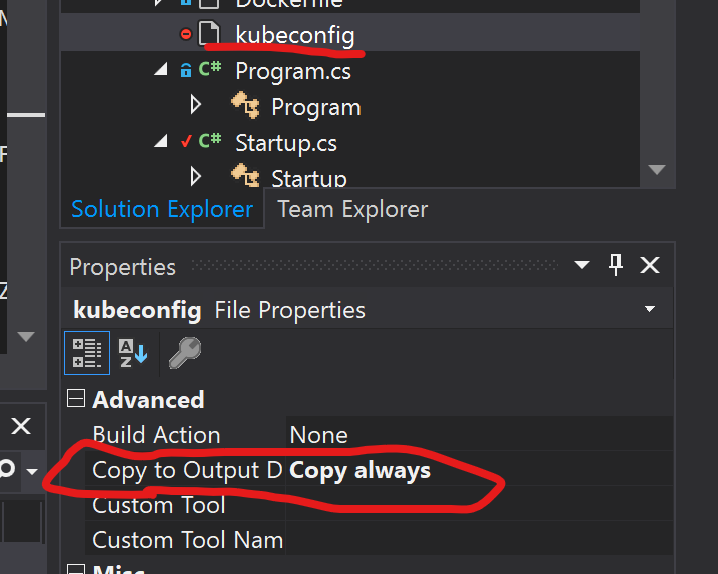

# Developer's Guide

This document explains how to setup the development enviornment for this project. 

## Durable Scale Server Development 

Server code is written by [gRPC service with ASP.NET Core](https://docs.microsoft.com/en-us/aspnet/core/grpc/aspnetcore?view=aspnetcore-3.0&tabs=visual-studio). 

### Configration 

If you are using Visual Studio 2019, you can configure the visual studio for enabling local debugging. 

#### launchSettings.json

You can add `Properties/launchSettings.json` under `Keda.Durable.Scaler.Server`. It configures deubgging time enviornment variables and providing configuration for gRPC service. For the detail configration of the environment variables, please refer the [KEDA Durable Scaler Configration](reference.md). `applicationUrl` is the URL for the Server endpoint. If you want to test HTTPS protocol, you can make it as `https://localhost:5001`.

```json
{
  "profiles": {
    "Keda.Durable.Scaler.Server": {
      "commandName": "Project",
      "environmentVariables": {
        "CONNECTION_STRING": "<YOUR_STORAGE_ACCOUNT_CONNECTION_STRING_HERE>",
        "TASK_HUB": "DurableFunctionsHub",
        "MAX_POLLING_INTERVAL": "5000",
        "ASPNETCORE_ENVIRONMENT": "Development",
        "CERT_PATH": "C:\\Users\\tsushi\\grpcsv.pfx",
        "CERT_PASS": "keda"
      },
      "applicationUrl": "http://localhost:5000"
    },
    "Docker": {
      "commandName": "Docker",
      "launchUrl": "{Scheme}://{ServiceHost}:{ServicePort}",
      "environmentVariables": {
        "CONNECTION_STRING": "<YOUR_STORAGE_ACCOUNT_CONNECTION_STRING_HERE>",
        "TASK_HUB": "DurableFunctionsHub",
        "MAX_POLLING_INTERVAL": "5000",
        "ASPNETCORE_ENVIRONMENT": "Development"
      },
      "httpPort": 5000
    },
   }
}   
```

#### kubeconfig 

You can place `kubeconfig` file for your local debugging. Get the `kubeconfig` file and put it under `Keda.Durable.Scaler.Server`. It is under the `.gitignore` file. Don't forget make `kubeconifg` as `Copy always`.



For getting the kubeconfig of your kubernes cluster, if you are using Azure, you can do like this. 

```bash
$ az aks get-credentials --name MyManagedCluster --resource-group MyResourceGroup
```

Then you can find the `kubeconfig` file under `~/.kube/config` copy it as `kubeconfig` and put it under the `Keda.Durable.Scaler.Server`. 

### Secret and Crtificate

You can refer [Getting Started](getting-started.md) to create and configure certificate for https. 

### Important Classes 

For reading this code, there is several important files are there. 

#### [ExternalScalerService](https://github.com/microsoft/keda-durable-scaler/blob/master/src/Keda.Durable.Scaler.Server/Services/ExternalScalerService.cs)

Core logic of the scaling. This class implement scaler logic of this server. It uses, [DurableTask.DisconnectPerformanceMonitor](https://github.com/Azure/durabletask/blob/master/src/DurableTask.AzureStorage/Monitoring/DisconnectedPerformanceMonitor.cs#L89) for getting analytics data nad telemetry. 

#### [externalscaler.proto](https://github.com/microsoft/keda-durable-scaler/blob/master/src/Keda.Durable.Scaler.Server/Protos/externalscaler.proto)

Protocol buffer of the [External Scaler Support for KEDA](https://github.com/kedacore/keda/pull/294). Usually, you might need to generate code from this buffer. It is automatically done by [gRPC services with ASP.NET Core](https://docs.microsoft.com/en-us/aspnet/core/grpc/aspnetcore?view=aspnetcore-3.0&tabs=visual-studio). You can see the generated file under the obj directory, however, you don't need commit these files to the repo. 

#### [Startup.cs](https://github.com/microsoft/keda-durable-scaler/blob/master/src/Keda.Durable.Scaler.Server/Startup.cs#L21)

It contains DI configration for the server, it also include Enviornment Variables configration for the Server. 

### Update images

If you want to test the image of this server, you can copy and modify the
[../deploy/build_push_image.sh](../deploy/build_push_image.sh). The script help to build/deploy docker images and push to the DockerHub. Don't forget to change the image name for your own. You also need to modify [../deploy/deployment.yml] for deploying it. 

### Run Server locally

If you want to run the server locally, after executing the docker build, you can try this command. 

```bash
$ docker build . -t durable-server
$ docker run -d -e "AzureWebJobsStorage=<YOUR_STORAGE_ACCOUNT_CONNECTION_STRING_HERE>" -e "FUNCTIONS_WORKER_RUNTIME=dotnet" -e "WEBSITE_HOSTNAME=localhost:80" -p 8802:80 durable-sever
```

## Durable Functions Development 

You can develop the Durable Functions for deploying to kubernetes. However, there is some consideration required to make it work. I explain some tips on [Getting Started](getting-started.md). Please refer it first. 

I also add how to configure development enviornment. If you want to debug locally, you need to use [Azure Functions Core Tools](https://github.com/Azure/azure-functions-core-tools)

### local.settings.json

You can copy and modify `local.settings.json.example`.

```bash
$ cp local.settings.json.example local.setting.json
```

Modify `<YOUR_STORAGE_CONNECTION_STRING_HERE>` to your Storage Account Connection String that is used by Durable FUnctions. 

_local.settings.json_

```json
{
    "IsEncrypted": false,
    "Values": {
        "AzureWebJobsStorage": "<YOUR_STORAGE_CONNECTION_STRING_HERE>",
        "FUNCTIONS_WORKER_RUNTIME": "dotnet"
    }
}
```
